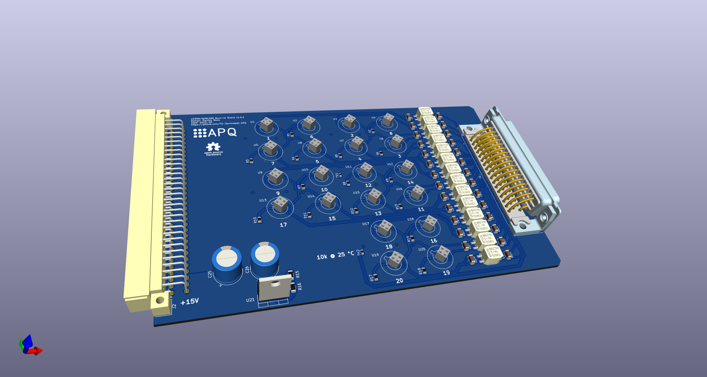

# ADR1399/LM399 Burnin Board
This repository contains the [KiCad](https://www.kicad.org/) schematics and design files for test board to burn in [ADR1399](https://www.analog.com/media/en/technical-documentation/data-sheets/adr1399.pdf) and [LM399](https://www.analog.com/media/en/technical-documentation/data-sheets/199399fc.pdf) voltage references.

## Contents
- [Introduction](#introduction)
- [Design Files](#design-files)
- [Related Repositories](#related-repositories)
- [Versioning](#versioning)
- [License](#license)

## Introduction
This board can support up to 20 [ADR1399](https://www.analog.com/media/en/technical-documentation/data-sheets/adr1399.pdf) or [LM399](https://www.analog.com/media/en/technical-documentation/data-sheets/199399fc.pdf) voltage references. Using a [DD-50](https://en.wikipedia.org/wiki/D-subminiature) connector, these reference can be monitored using a multiplexer and a DMM. In combination with the [2000-SCAN SSR Replacement](https://github.com/PatrickBaus/SCAN2000) up to 10 references can be scanned using a [Keithley Model 2002](https://www.tek.com/en/products/keithley/digital-multimeter/2002-series).

## Design Files
### For production
The design files required for the PCB production and assembly can be found on the [releases](../../releases) page and include the following resources:

- Schematics as a PDF
- Gerber files
- Pick & place position files
- Bill of materials as a CSV file and also as an interactive HTML version

The latest revision of those files can be found [here](../../releases/latest).

## Related Repositories
See the following repositories for more information.

- [KiCad footprints](https://github.com/PatrickBaus/footprints.pretty)
- [KiCAD schematic libraries](https://github.com/PatrickBaus/KiCad-libraries)
- [2000-SCAN SSR Replacement](https://github.com/PatrickBaus/SCAN2000)

## Versioning
I use [SemVer](http://semver.org/) for versioning. For the versions available, see the [tags](../../tags) available for this repository.

- MAJOR versions in this context mean a breaking change to the external interface of the hardware like different connectors or functions.
- MINOR versions contain changes to the hardware that only affect the inner workings of the circuit, but otherwise the performance is unaffected.
- PATCH versions do not affect the schematics or invalidate older bill of materials. These changes may include updated components (to replace obsolete parts for example), an updated silkscreen, or fixed typos.

## License
This work is released under the CERN-OHL-W
See [https://ohwr.org/cern_ohl_w_v2.pdf](https://ohwr.org/cern_ohl_w_v2.pdf) or the included LICENSE file for more information.
